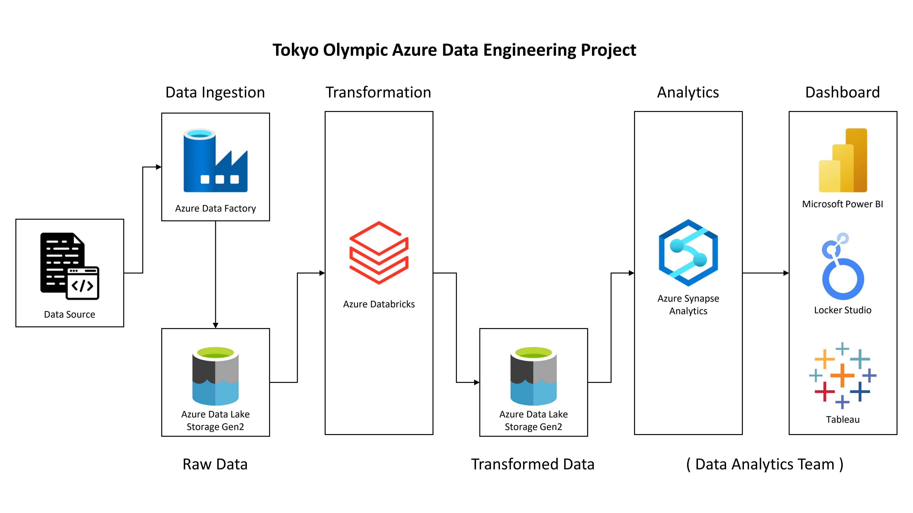

# Tokyo Olympic Data Analytics | End-to-End Azure Data Engineering Pipeline

## Overview

This project delivers a complete, cloud-native data engineering pipeline designed to ingest, process, transform, and serve the **2021 Tokyo Olympic Games dataset**.

The primary business goal is to transform raw CSV datasets containing information on **athletes, coaches, teams, entries by gender, and medal tallies** into refined analytical datasets.

Raw datasets are hosted directly in this GitHub repository and fetched dynamically using **GitHub Raw URLs via Azure Data Factory**.

Using an automated cloud architecture, this engineering solution prepares **high-performance Parquet datasets** and **queryable SQL views**, serving them directly to the Data Analytics / BI team for downstream reporting and dashboard creation.

---

## Architecture Diagram

Below is the end-to-end data pipeline architecture spanning the **ingestion, storage, transformation, serving, and handoff layers**.



---

## Tech Stack

| Layer                         | Technology                                     |
| ----------------------------- | ---------------------------------------------- |
| Version Control & Source Data | GitHub (GitHub Raw Content Endpoints)          |
| Data Ingestion                | Azure Data Factory (ADF)                       |
| Data Storage                  | Azure Data Lake Storage Gen2 (ADLS Gen2)       |
| Data Transformation & Compute | Azure Databricks, Apache Spark (PySpark)       |
| Data Warehousing & Querying   | Azure Synapse Analytics (Serverless SQL Pools) |

---

# Step-by-Step Setup Guide

## 1. Provision Infrastructure & Authentication

### 1.1 Create Azure Resource Group

Create an Azure Resource Group named:

```text
tokyo-olympic
```

Use the **Southeast Asia** region.

### 1.2 Create ADLS Gen2 Storage Account

Provision an Azure Data Lake Storage Gen2 account named:

```text
tokyoolympicdata
```

Enable **Hierarchical Namespace**.

### 1.3 Create Storage Container

Create a container named:

```text
tokyo-olympic-data
```

Create the following directories:

```text
tokyo-olympic-data/
├── raw-data/
└── transformed-data/
```

### 1.4 Configure Authentication

Register an Azure Active Directory App Service Principal:

```text
app-tokyo-olympic
```

Generate a **Client Secret** and assign the following role on the storage account:

```text
Storage Blob Data Contributor
```

---

# 2. Configure Data Ingestion — Azure Data Factory

### 2.1 Create Azure Data Factory

Provision an Azure Data Factory workspace named:

```text
tokyo-olympic-df
```

### 2.2 Configure GitHub HTTP Linked Service

Set up an **HTTP Linked Service** pointing to the raw URL base path of the GitHub repository.

Example:

```text
https://raw.githubusercontent.com/<YOUR_GITHUB_USERNAME>/<YOUR_REPO_NAME>/main/data/
```

### 2.3 Create Ingestion Pipeline

Create a pipeline named:

```text
data-ingestion
```

Configure **Copy Data** activities to fetch the following CSV files from GitHub:

```text
Athletes.csv
Coaches.csv
EntriesGender.csv
Medals.csv
Teams.csv
```

Store the files in:

```text
tokyo-olympic-data/raw-data/
```

---

# 3. Data Transformation — Azure Databricks

### 3.1 Create Azure Databricks Workspace

Provision an Azure Databricks workspace named:

```text
tokyo-olympic-db
```

Start a **single-node cluster**.

### 3.2 Connect Databricks to ADLS Gen2

Mount the ADLS Gen2 container:

```text
tokyo-olympic-data
```

using the configured **Service Principal credentials**.

### 3.3 Run Transformation Notebook

Run the following notebook:

```text
Tokyo Olympic Transformation.ipynb
```

The transformation process performs the following steps:

1. Read raw CSV files from:

```text
/mnt/tokyoolympic/raw-data/
```

2. Load the data into **PySpark DataFrames**.

3. Enforce explicit schema definitions.

4. Clean and standardize numeric data types.

5. Handle missing values.

6. Transform and prepare the datasets for analytics.

7. Export the processed datasets to:

```text
tokyo-olympic-data/transformed-data/
```

8. Store the transformed datasets using **Snappy-compressed Parquet format**.

---

# 4. Data Serving & Analytics — Azure Synapse Analytics

### 4.1 Create Azure Synapse Workspace

Provision an Azure Synapse workspace named:

```text
tokyo-olympic-sa
```

Connect the workspace to the Lake database:

```text
TokyoOlympicDB
```

### 4.2 Create External Tables

Create external tables pointing to the transformed Parquet files stored in:

```text
transformed-data/
```

### 4.3 Execute SQL Validation

Execute **Serverless SQL analytical scripts** to:

* Validate the transformed data schema.
* Validate data availability.
* Perform data quality checks.
* Pre-aggregate core analytical metrics.

---

# 5. Analytics Team Handoff & Data Consumption

Provide the Data Analytics / BI team with read access to the transformed data layer through the following endpoints.

## 5.1 Serverless SQL Endpoint

Expose Azure Synapse **views and external tables** from:

```text
TokyoOlympicDB
```

These can be consumed through BI and analytics tools such as:

* Power BI
* Tableau
* Looker Studio

### Serverless SQL Endpoint

```text
tokyo-olympic-sa-ondemand.sql.azuresynapse.net
```

### Database Name

```text
TokyoOlympicDB
```

---

## 5.2 Direct Storage Endpoint

Grant read access to the underlying Parquet files stored at:

```text
abfss://tokyo-olympic-data@tokyoolympicdata.dfs.core.windows.net/transformed-data/
```

This endpoint can be used for custom analytics pipelines and downstream data processing.

---

# Key Insights — Pre-Aggregated SQL Validation

Based on pre-aggregated SQL queries executed in **Azure Synapse Analytics** prior to the BI handoff:

### 1. Top Country Participation

The **United States of America and Japan** sent the largest athlete contingents across the highest number of overall disciplines.

### 2. Medal Dominance

The medal tally was led by top-performing nations, with a strong correlation between **total team size and cumulative gold medal counts**.

### 3. Gender Balance Across Disciplines

Certain sports, such as **Swimming and Athletics**, achieved high parity in male and female entry counts, whereas specific niche disciplines displayed significant variation in total participant entries.

